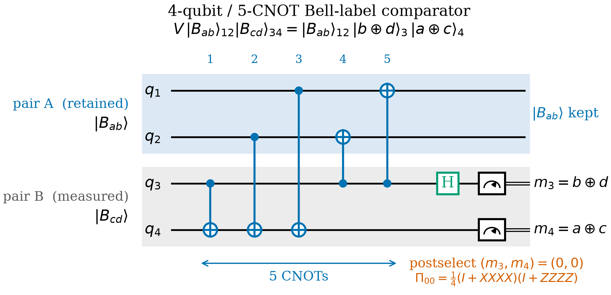

# Bell-state-distillation

A **4-qubit / 5-CNOT** circuit that physically purifies a Bell pair, implemented
from first principles and verified against independently derived analytics.

Headline result, all reproduced by executed code:

    V |B_ab>_12 |B_cd>_34  =  |B_ab>_12 |b xor d>_3 |a xor c>_4

so postselecting `(q3,q4) = (0,0)` keeps the first pair exactly when the two
pairs carry identical Bell labels, and for **Bell-diagonal** input

    rho_out = rho^2 / Tr(rho^2) ,      P_success = Tr(rho^2)

with the Bell-isotropic special case

    P_success = (4 - 6 eps + 3 eps^2)/4 ,   eps' = eps^2/(4 - 6 eps + 3 eps^2)

> **Scope warning.** The `rho^2` identity holds **only for Bell-diagonal
> inputs**; in general the circuit realizes a Bell-basis *elementwise* square.
> The protocol is postselective and is **not** LOCC.  See
> [`docs/limitations.md`](docs/limitations.md).  Nothing here is a novelty claim.

---

## 1. Research motivation

Purification maps a noisy state to `P(rho) = rho^2/Tr(rho^2)`, concentrating
weight on the dominant eigenvector.  For a noisy Bell pair this removes the
leading error.  The open practical question is what it costs to do this with a
real, noisy circuit.

## 2. Previous VD / PQEC context

**Virtual Distillation** and the postselection-free **PQEC** formulation
estimate `Tr(O rho^2)/Tr(rho^2)` from two copies through parity-weighted
statistics.  Crucially they do not necessarily *prepare* `rho^2/Tr(rho^2)` in
any single shot.  See [`docs/research_context.md`](docs/research_context.md).

## 3. The 5-qubit SWAP-test baseline

Standard SWAP-test PQEC on a 2-qubit Bell state uses **five** qubits — one
ancilla plus two 2-qubit copies — and a controlled-SWAP of the two registers
(two Fredkin gates).

## 4. The 16 / 14 / 14-CNOT implementations

The parent project compared CNOT decompositions of that same ideal unitary:
textbook (**16**), compiler-resynthesized (**14**) and learned-and-pruned
(**14** — the task brief said 12; the parent repository's Step 5 circuit and
its frozen data used here have 14).  The ideal unitaries agree; the *noisy channels* need not, and the
repeated map `rho_{n+1} = M_p(rho_n)` can differ in fixed points and invariant
manifolds between them.

A comparison of the **repeated-round fixed points at equal per-CNOT noise** is
in [`docs/comparison_swap_test.md`](docs/comparison_swap_test.md): the noise
convention is the same, but the protocols and their resource accounting are
not, so it is an equal-gate-quality comparison of the effective maps — not an
equal-resource one.  See also [`docs/limitations.md`](docs/limitations.md) §7.

## 5. Motivation for the new 4-qubit circuit

The second Bell pair is discarded after purification anyway.  So: **drop the
SWAP-test ancilla and use the second pair itself as the parity register.**
Four qubits, five CNOTs, one Hadamard.

## 6. The exact circuit

Qubit order is `|q1 q2 q3 q4>` with **q1 most significant** (0-based indices
`q1->0 .. q4->3`; *not* Qiskit's little-endian convention).

    retained pair A = (q1, q2)        measured pair B = (q3, q4)

    1. CNOT q3 -> q4
    2. CNOT q2 -> q4
    3. CNOT q1 -> q4
    4. CNOT q3 -> q2
    5. CNOT q3 -> q1
    6. H on q3
    7. measure q3, q4 ; postselect (0,0) ; keep q1,q2

```
q1 ───────────────●───────────⊕────  keep (retained pair A)
q2 ─────────●─────│─────⊕─────│────  keep (retained pair A)
q3 ───●─────│─────│─────●─────●─────[H]─ measure  m3
q4 ───⊕─────⊕─────⊕───────────────────── measure  m4
```



Both the ASCII diagram and the figure are generated directly from
`CNOT_SEQUENCE` (`scripts/draw_circuit.py`, `scripts/draw_circuit_figure.py`),
so neither can drift out of sync with the simulated circuit.  The figure is
also written as a fully vector `results/figures/circuit_5cnot.pdf`
(embedded TrueType, no Type-3 fonts, no raster XObjects).

The gate list lives in `CNOT_SEQUENCE` (`src/pqec_distill/circuit.py`) and is
pinned by a test against silent reordering or direction flips.

## 7. Bell-label interpretation

With `|B_ab> = 2^(-1/2) sum_r (-1)^(br) |r, r xor a>` (so `ZZ -> (-1)^a`,
`XX -> (-1)^b`; `B_00..B_11 = Phi+, Phi-, Psi+, Psi-`), the measured bits are
the eigenvalues of two commuting four-qubit stabilizers:

    V^dag Z_3 V = X1 X2 X3 X4        ->   m3 = b xor d      (phase label)
    V^dag Z_4 V = Z1 Z2 Z3 Z4        ->   m4 = a xor c      (flip label)

    Pi_00 = (1/4)(I + XXXX)(I + ZZZZ)

The circuit is a **Bell-label comparator**: it reveals the XOR of the two label
pairs and nothing else, so success means "the two pairs had the same Bell
label".  Measured `(m3,m4)` table (rows = first pair, columns = second):

|         | Phi+ | Phi- | Psi+ | Psi- |
|---------|------|------|------|------|
| **Phi+**| 00   | 10   | 01   | 11   |
| **Phi-**| 10   | 00   | 11   | 01   |
| **Psi+**| 01   | 11   | 00   | 10   |
| **Psi-**| 11   | 01   | 10   | 00   |

## 8. Physical postselection vs virtual distillation

| | virtual distillation / PQEC | this circuit |
|---|---|---|
| output | expectation values only | a genuine physical state |
| cost | sampling overhead | postselection, `P = Tr(rho^2) < 1` |
| validity of `rho^2` | any `rho` (as a statistic) | Bell-diagonal `rho` only |
| ancilla | needed (SWAP test) | none |

## 9. Verified formulas

For a general two-qubit input, the success Kraus operator is
`K_00 = sum_i |B_i><B_i| (x) <B_i|`, giving the Bell-basis **elementwise**
square `(rho_tilde_00)_ij = (rho_ij)^2`.  For Bell-diagonal `rho` this equals
`rho^2`, so

    rho_tilde_00 = sum_ab p_ab^2 B_ab = rho^2
    rho_out      = rho^2 / Tr(rho^2)

All four branches, for Bell-diagonal input:

    rho_tilde_{mu,nu} = sum_ab p_ab p_{a xor nu, b xor mu} B_ab
    P_{mu,nu}         = sum_ab p_ab p_{a xor nu, b xor mu}
    sum_{mu,nu} rho_tilde_{mu,nu} = rho          (no postselection -> input back)

Repeated ideal rounds:  `rho_l = rho^(2^l)/Tr[rho^(2^l)]`, and the full
`2^l`-copy tree succeeds with probability `Tr[rho^(2^l)]`.

## 10. Success probability

    P_success = Tr(rho^2) = sum_i p_i^2

## 11. Bell-isotropic example

`rho_eps = (1-eps)Phi+ + eps I/4`, `F = 1-3eps/4`, `q = eps/4`:

    P_success = F^2 + 3q^2 = (4 - 6eps + 3eps^2)/4
    F_out     = F^2/(F^2 + 3q^2)
    eps'      = eps^2/(4 - 6eps + 3eps^2) = eps^2/4 + (3/8)eps^3 + O(eps^4)

Reproduced by the circuit (from `results/data/isotropic_reference_points.csv`):

| eps | F_in | P_success | F_out | eps' | C_out |
|---|---|---|---|---|---|
| 0.00 | 1.000000 | 1.00000000 | 1.0000000000 | 0.000000000000 | 1.000000 |
| 0.01 | 0.992500 | 0.98507500 | 0.9999809659 | 0.000025378778 | 0.999962 |
| 0.10 | 0.925000 | 0.85750000 | 0.9978134111 | 0.002915451895 | 0.995627 |
| 0.40 | 0.700000 | 0.52000000 | 0.9423076923 | 0.076923076923 | 0.884615 |
| 2/3  | 0.500000 | 0.33333333 | 0.7500000000 | 0.333333333333 | 0.500000 |
| 0.70 | 0.475000 | 0.31750000 | 0.7106299213 | 0.385826771654 | 0.421260 |
| 0.80 | 0.400000 | 0.28000000 | 0.5714285714 | 0.571428571429 | 0.142857 |
| 0.90 | 0.325000 | 0.25750000 | 0.4101941748 | 0.786407766990 | 0.000000 |
| 1.00 | 0.250000 | 0.25000000 | 0.2500000000 | 1.000000000000 | 0.000000 |

Over 501 sweep points the circuit and the independent analytics agree to
**7.8e-16**.

## 12. Non-Bell-diagonal limitation

`(rho_tilde_00)_ij = (rho_ij)^2` is a **Schur** square in the Bell basis.  It
coincides with `rho^2` only when the Bell-basis coherences vanish.  On 40 random
non-Bell-diagonal states the circuit output differs from `rho^2/Tr(rho^2)` by
more than `1e-6` in every case while matching the Schur square to `<1e-12`.

## 13. Non-LOCC caveat

Read as distributed pairs (Alice `{q1,q3}`, Bob `{q2,q4}`), **three of the five
CNOTs cross the Alice/Bob cut**.  This is single-processor Bell-pair
purification, **not** network LOCC distillation — which is why the circuit can
produce an entangled output from a separable input for
`2/3 <= eps < 2 - 2sqrt(3)/3 ~= 0.8453`.

## 13b. Noisy CNOTs: exact threshold and repeated-round fixed point

With the replacement channel after every CNOT (`qbar = 1 - p`; the Pauli
convention is the same family with `qbar = 1 - 16p/15`), Heisenberg
propagation of the success observables gives the **exact** one-round map on
Bell-diagonal states  `rho = 1/4(II + xXX + yYY + zZZ)`:

    D  = 1 + qbar^5 (x^2 + y^2) + qbar^3 z^2,      P_success = D/4
    x' = qbar^3 [(1+qbar) x - 2 qbar^2 y z] / D
    y' = qbar^4 [(1+qbar) y - 2 qbar   x z] / D
    z' = qbar^4 [(1+qbar) z - 2 qbar   x y] / D

(matches the dense simulator to 4.4e-16; reduces to `rho^2/Tr(rho^2)` at
`p = 0`).  The plane `y = -z` is invariant, so a Bell-isotropic input stays on
`rho(u,v) = 1/4[II + uXX + v(ZZ - YY)]` with `F = (1 + u + 2v)/4`.

**One-round threshold.**  `F_1(1, p) = 1 - p - (5/4)p^2 + ...` for a pure Bell
input.  The largest `p` at which one round still improves `F` solves a quintic:

| eps | 0.05 | 0.1 | 0.2 | 0.3 | 0.5 | 2/3 | 0.9 |
|---|---|---|---|---|---|---|---|
| `p*` (replacement) | 0.0337 | 0.0612 | 0.1028 | 0.1321 | 0.1665 | 0.1774 | 0.1686 |

`p*` is **not monotone**: it peaks at `0.1779` near `eps ~ 0.71` and falls for
noisier inputs.

**Repeated rounds** (`rho_{n+1} = M_p(rho_n)`, two copies of the postselected
output feed the next round).  The `Phi+` branch of fixed points obeys

    u* = 1 - p - (13/4)p^2,   v* = 1 - (3/2)p - (33/8)p^2,   F* = 1 - p - (23/8)p^2

and exists up to a saddle node at **`p_SN = 0.180670`**, becoming separable at
**`p_ent = 0.179815`**.  Beyond `p_SN` every Bell-isotropic input decays to
`I/4`.  There is one such attractor per Bell state (four symmetric images); a
generic input is purified toward whichever Bell state dominates it.

**Stability — a full-state attractor, not a saddle.**  The exact 15x15
Jacobian at the fixed point has spectral radius equal to the Bell-sector value
(`0.019` at `p = 0.01`) and **all twelve off-Bell eigenvalues vanish**: the map
is a Bell-basis Schur square, so off-Bell coherences enter only at second
order (`delta -> delta^2`; a seed of `1e-2` becomes `3.6e-5`, then `4.6e-10`).
This is the same structural fact that limits the protocol to Bell-diagonal
inputs, now working in its favour.  Data: `results/data/noisy_threshold.csv`,
`repeated_fixed_points.csv`, `repeated_trajectories.csv`.

## 14. Reproducing every result

```bash
git clone https://github.com/Han-JaeHoon/Bell-state-distillation.git
cd Bell-state-distillation
python -m venv .venv && source .venv/bin/activate
pip install -e ".[test]"

pytest -q                                # full suite

cd scripts
python draw_circuit.py                   # ASCII circuit from the gate list
python draw_circuit_figure.py            # circuit figure -> figures/ (PDF + PNG)
python verify_all_bell_inputs.py         # 16 Bell-product cases      -> data/
python sweep_isotropic.py                # 501-point eps sweep        -> data/, figures/
python analyze_repeated_rounds.py        # repeated ideal rounds      -> data/, figures/
python sweep_noisy_circuit.py            # phase 2: noisy CNOTs       -> data/, figures/
python noisy_threshold.py                # exact one-round threshold  -> data/, figures/
python repeated_noisy_dynamics.py        # repeated noisy rounds      -> data/, figures/
python compare_with_swap_test.py         # vs 5-qubit Steps 3/4/5     -> data/, figures/
python noisy_threshold.py                # exact one-round threshold  -> data/, figures/
python repeated_noisy_dynamics.py        # repeated noisy rounds      -> data/, figures/
```

Everything in `results/` is regenerated by those eight scripts; no value is
entered by hand.  `results/verification_report.md` records the outcome of every
check, labelled PROVED / NUMERICALLY VERIFIED / OBSERVED / NOT TESTED.

## Layout

```
src/pqec_distill/
  gates.py              dense n-qubit gates from first principles
  bell_states.py        Bell states from the defining formula, basis transforms
  circuit.py            the 5-CNOT gate list and V = H_3 U_CNOT
  measurement.py        projectors, partial trace, branch postselection
  analytics.py          analytic targets -- imports NO simulator module
  entanglement.py       concurrence, negativity
  noise.py              two configurable per-CNOT noise conventions
  noisy_analytics.py    exact noisy Bell-diagonal map, threshold, fixed points
  repeated_noisy.py     dense repeated map, exact 15x15 Jacobian
  swap_test_reference.py parent project's Step 3/4 recursions (for the comparison)
  noisy_analytics.py    exact noisy Bell-diagonal map, threshold, fixed points
  repeated_noisy.py     dense repeated map, exact 15x15 Jacobian
  pauli_propagation.py  independent rule-based Clifford propagation (no matrices)
tests/                  2055 tests, deterministic seeds
scripts/                eight reproducible entry points
docs/                   research context, full derivation, limitations, SWAP-test comparison
results/                data/, figures/, verification_report.md
```

### Independence of the verification routes

`analytics.py` deliberately imports none of `gates`, `circuit`, `measurement`
or `bell_states`; it re-declares the Bell vectors literally, and a test asserts
the two constructions agree.  The stabilizer mapping is checked twice — by dense
matrix conjugation and by `pauli_propagation.py`, which uses only Clifford
conjugation rules and no matrices.
