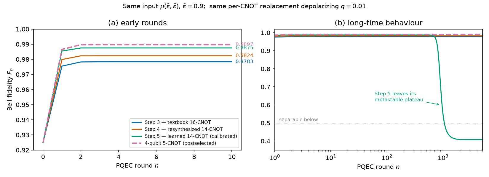
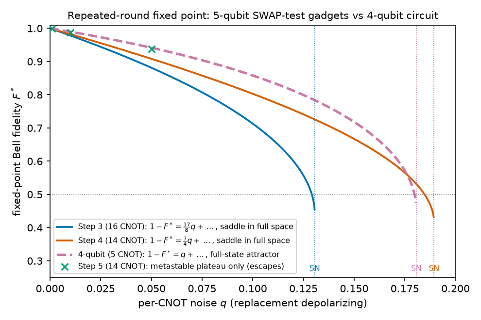

# Comparison with the 5-qubit SWAP-test gadgets (Steps 3/4/5)

How the repeated-round convergence point of the 4-qubit circuit compares with
the parent project's three implementations of the 5-qubit SWAP-test PQEC
gadget, **at the same per-CNOT noise**.

## What is being compared, and what is not

**Same:** the noise model.  Both projects insert the two-qubit *replacement*
depolarizing channel `(1-q) rho + q [I/4 (x) Tr(rho)]` after every CNOT and
keep single-qubit gates and measurement ideal.  So `q` here and `p` in the
rest of this repository are the same quantity, and comparing at equal `q`
means comparing at equal gate quality.

**Different:** the protocol and the resource accounting.

| | 5-qubit SWAP-test (Steps 3/4/5) | 4-qubit circuit (this repository) |
|---|---|---|
| CNOTs per round | 16 / 14 / 14 | 5 |
| read-out | ancilla parity correlator, no postselection | postselect `(m3,m4) = (0,0)` |
| "output state" | effective parity-weighted `tau_A / Tr tau_A` — not prepared shot by shot | a physical state, on the branch that succeeds |
| cost | sampling overhead `~ 1/Q*^2` (`Q* ~ 0.84-0.86` at `q = 0.01`) | success probability `P_succ* < 1` (`0.949` at `q = 0.01`, `0.761` at `0.05`, `0.563` at `0.10`), compounding over a purification tree |
| meaning of "repeat" | idealised: the effective state is assumed re-preparable as two copies | literal: the postselected state is re-prepared as two copies |

So the honest statement is: *at equal per-CNOT error the 4-qubit circuit
reaches a higher and more stable fixed point, at the price of postselection
loss*.  An equal-resource comparison (total Bell pairs or total shots consumed)
has **not** been done here.

## Sources

- Steps 3 and 4: the exact Bell-sector `(u, v)` recursions and closed-form
  fixed points of the parent notes *Step 3 / Step 4: Analytic Repeated
  Dynamics*, re-implemented in `src/pqec_distill/swap_test_reference.py`.
  Their state family is `rho = 1/4[II + u(XX - YY) + v ZZ]`, `F = (1+2u+v)/4`
  — a different invariant plane from the 4-qubit circuit's `y = -z`.
- Step 5 has no fixed point on the `Phi+` branch (its noisy map leaves the
  Bell-diagonal sector), so its long-round trajectory is taken from the parent
  repository's data, frozen verbatim in `results/data/external/` with SHA-256
  recorded in `PROVENANCE.md` there.  Its "plateau" values are the parent's
  solver fixed points, which are metastable.
- `tests/test_comparison.py` checks the frozen files' hashes, that the
  re-implemented Step 3/4 recursions reproduce the frozen dense trajectories to
  `< 1e-12`, and the tabulated values quoted in the parent notes.

Reproduce with `python scripts/compare_with_swap_test.py`.

## Same condition as the parent's Figure 1: `eps_bar = 0.9`, `q = 0.01`

| | Step 3 (16) | Step 4 (14) | Step 5 (14) | **4-qubit (5)** |
|---|---|---|---|---|
| `F_10` | 0.9783 | 0.9824 | 0.9875 | **0.9897** |
| `F_5000` | 0.9783 | 0.9824 | **0.408** (escaped) | **0.9897** |
| rounds to within `1e-6` of `F*` | 4 | 4 | — | 4 |
| long-time behaviour | Bell-sector fixed point | Bell-sector fixed point | metastable plateau → separable product state | fixed point |

Step 5 attains the best plateau of the three gadgets and then collapses near
`n ~ 1000`; the 4-qubit circuit reaches a *higher* value in four rounds and
stays there.

## Fixed-point fidelity versus `q`

| `q` | Step 3 | Step 4 | Step 5 plateau | **4-qubit** | 4-qubit `P_succ*` |
|---|---|---|---|---|---|
| 0.001 | 0.997871 | 0.998249 | 0.998750 | **0.998997** | 0.995 |
| 0.010 | 0.978346 | 0.982351 | 0.987507 | **0.989704** | 0.949 |
| 0.030 | 0.932229 | 0.946053 | — | **0.967152** | 0.851 |
| 0.050 | 0.881237 | 0.908138 | 0.937304 | **0.941508** | 0.761 |
| 0.100 | 0.712918 | 0.802811 | — | **0.857878** | 0.563 |
| 0.150 | — | 0.667050 | — | **0.718126** | 0.395 |
| 0.170 | — | 0.589903 | — | **0.614101** | 0.329 |

First-order asymptotic loss `1 - F* = A q + ...`:

    Step 3: A = 17/8      Step 4: A = 7/4      Step 5 (one round): A = 5/4      4-qubit: A = 1

Existence and entanglement limits of the `Phi+` branch:

| | Step 3 | 4-qubit | Step 4 |
|---|---|---|---|
| `q_SN` | 0.130579 | 0.180670 | 0.189417 |
| `q_ent` | 0.129137 | 0.179815 | 0.184736 |

Step 4's branch survives slightly longer than the 4-qubit one (the two curves
cross near `q ~ 0.175`), but in that window both are already at `F* ~ 0.55`.
Below `q = 0.17` the ordering is `F*(4-qubit) > F*(Step 4) > F*(Step 3)`
everywhere (tested on a 60-point grid).

## The qualitative difference: stability

| | full-state `rho(J)` at `q = 0.01` | Bell-diagonal closure under noise | character of the fixed point |
|---|---|---|---|
| Step 3 | 1.023 | yes | **saddle**: an off-Bell seed escapes |
| Step 4 | 1.018 | yes | **saddle** |
| Step 5 | 1.012 (plateau) | **no** — `O(q)` leakage | supplies its own seed and escapes |
| **4-qubit** | **0.019** | yes | **attractor**: all 12 off-Bell eigenvalues vanish |

Steps 3 and 4 stay at their fixed points only because exact arithmetic never
excites the unstable off-Bell direction `(ZI+IZ)/sqrt2` (parent verification
note: a seed of `1e-8` escapes after ~606 rounds).  The 4-qubit circuit
contracts the same seed quadratically, `1e-2 -> 3.6e-5 -> 4.6e-10 -> 0`.

The reason is structural.  For `rho -> rho^2/Tr(rho^2)` an eigenbasis
coherence between eigenvalues `lambda_i, lambda_j` is amplified by
`(lambda_i + lambda_j)/Tr(rho^2) > 1` — that is the parent project's saddle
mechanism.  The 4-qubit success branch is instead a *Bell-basis Schur square*
(`docs/derivation.md` §5, §14): an off-Bell coherence `delta` returns as
`delta^2`, so its linearisation at any Bell-diagonal state is zero.  The very
restriction that confines the exact `rho^2` identity to Bell-diagonal inputs is
what makes the repeated noisy dynamics robust.

## Caveats

- Equal-`q` is an equal-gate-quality comparison of the *effective maps*.  It
  is not an equal-resource comparison; see the table at the top.
- Step 5's plateau values come from the parent's solver at three `q` values
  only; they are metastable, not fixed points.
- The parent's stability numbers are quoted from its verification note; only
  the Step 3/4 recursions and the frozen trajectories are re-checked here.
- No novelty or superiority claim beyond these specific quantities is made;
  see `docs/limitations.md`.
